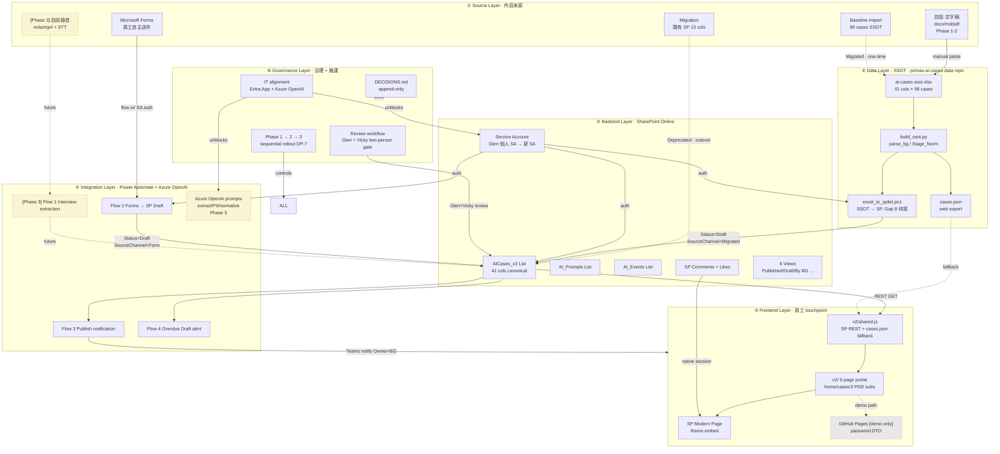
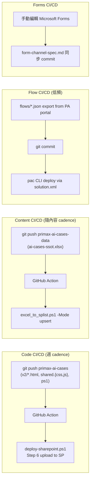

# Primax AI Cases — Architecture Overview

> **Last updated**: 2026-05-21
> **Status**: Locked architecture v1 (post 2026-05-21 decision lockdown)
> **Reads with**: `DECISIONS.md` / `deployment-plan.md` / `backend/sp-list-schema.md`

> ⚠️ **2026-06-24 DEPRECATION**：本文件描述的 **DP-5 前端部署路徑（v2/ 5-page portal + SharePoint iframe + SP REST fallback）已停用**。最終架構改採 **.NET8 + SQL Server + IIS + Entra**（見 `primax-ai-cases-it-deploy` repo）。本 repo `v2/`、`v3/`、`backend/` 已移除，現行前端唯一活躍版本為 `v4/`。下文 F-layer / SP 部署 / iframe / `backend/` 相關段落僅供歷史參照，不代表現況。詳見 `DECISIONS.md` 2026-06-24 條目。

本文件回答三個問題：
1. **這個系統由哪幾層組成？**（layers）
2. **內容怎麼從 raw input 走到員工看到？**（E2E data flow）
3. **長期怎麼維運？**（CI/CD + content lifecycle + ops cadence）

---

## Part 1 — 6-Layer Architecture



### Layer 1: Source Layer · 內容來源 (4+1 channels)

| Channel | Phase | Format | Auth required | Owner |
|---|---|---|---|---|
| Microsoft Forms | 1-2 onwards | structured fields | service account | 員工自助 |
| 訪談 + 文字稿 | 1 onwards | docx / md / pdf | Glen 手動匯入 | Glen |
| Baseline import | 1 (one-time) | SSOT Excel 98 cases | — | Glen |
| SP Migration | 1 (one-time) | 既有 13 半中文 schema | Glen 個人 SA | Glen |
| 訪談錄音 (m4a/mp4) | **3 (deferred)** | own-voice-get / Azure STT | — | TBD |

**對應決策**：
- D-NEW-03 「不強制 Teams，任何來源都收」= architecture-level scope（5 channels 都支援）
- DP-6 「Phase 1-2 不啟用錄音」= rollout-level scope（Channel 5 暫關）

### Layer 2: Data Layer · SSOT (`primax-ai-cases-data` repo)

| File | Role |
|---|---|
| `ai-cases-ssot.xlsx` | 41 cols × 98 cases canonical SSOT |
| `scripts/build_ssot.py` | bootstrap-only, REBUILD prompt 防誤觸 |
| `scripts/excel_to_json.py` | SSOT → `cases.json` (web export) |
| `scripts/excel_to_splist.ps1` | **缺，待寫** SSOT → SP List |
| `raw-extraction/INVENTORY.md` | 9-tier source provenance |

**對應決策**：
- DP-1 Schema lock V5 38 cols + DP-2 Company/Unit/Region = 41 cols
- D-C4-5 baseline metadata 補齊 = 此層 backlog (deferred)

### Layer 3: Backend Layer · SharePoint Online

| Asset | Role | Status |
|---|---|---|
| `AICases_v2` List | 41 cols canonical | 待建 (deploy-sharepoint.ps1) |
| `AI_Prompts` List | 員工分享 prompt | 待建 |
| `AI_Events` List | DTO 活動紀錄 | 待建 |
| SP Comments + Likes | 互動 D-NEW-05 | 待手動啟用 |
| Service Account | flow + script 寫入 | Glen 個人 SA (DP-4 stage 1) |
| 6 Views | Published / Draft / By BG / Recent ... | 待設定 |

**對應決策**：
- D-NEW-01 全集團 read = `Visitors` permission
- D-NEW-02 只 DTO 寫 = `Contribute` 限 Glen + Vicky (D-C4-4)
- D-C4-3 Benefits 證據必填 = List validation rule (EvidenceUrl required if Status >= Active-Internal)
- DP-3 manual publish = Glen 在此層手動操作 lifecycle
- DP-4 Glen 個人 SA → IT 新 SA

### Layer 4: Integration Layer · Power Automate + Azure OpenAI

| Flow | Phase | Trigger | Action |
|---|---|---|---|
| Flow 1 Interview Extraction | **3** | SP folder watch | Azure OpenAI extract → SP Draft |
| Flow 2 Forms → SP | **2** | Forms submission | service account POST → SP Draft |
| Flow 3 Publish Notification | 2 | SP item modified to Published | Teams adaptive card to BG |
| Flow 4 Overdue Draft Alert | 2 | Schedule daily 09:00 | Teams notify DTO if Draft >7d |

**對應決策**：
- D-C4-1 Microsoft Forms + flow = Flow 2 為 Phase 2 主力
- D-NEW-04 Azure OpenAI = Flow 1 Phase 3 dependency
- DP-6 不啟用錄音 = Flow 1 Phase 1-2 不 build (deferred to Phase 3)

### Layer 5: Frontend Layer · 員工 touchpoint

| Asset | Phase | Path | Audience |
|---|---|---|---|
| `v2/home.html` + 4 cases pages | 1 (upload) + 2 (live) | SP `SiteAssets/primax-ai-cases/v2/` | 集團全員 (read) |
| `v2/shared.js` SP REST + cases.json fallback | 2 (rewrite) | embedded in 5 pages | — |
| SP Modern Page "AI Cases" | 2 | `Pages/AI-Cases.aspx` w/ Embed Web Part iframe | 集團全員 |
| GitHub Pages demo (password DTO) | 1 (sunset post-SP) | external Pages | 主管 demo only |

**對應決策**：
- DP-5 v2/ + iframe = Phase 1 上傳 + Phase 2 切 live REST
- D-NEW-01 全集團可見 = 透過 SP permission，不再用 password
- Phase 1 完成後 GitHub Pages **shutdown**（per MEMORY 05-21 informed risk 後段）

### Layer 6: Governance Layer · 治理 + 維運

| Asset | Role |
|---|---|
| `DECISIONS.md` | append-only governance log |
| Review workflow | Glen + Vicky two-person gate |
| IT alignment tickets | Entra App + Azure OpenAI + PA Premium |
| `deployment-plan.md` Phase 1→2→3 sequence | rollout discipline (DP-7) |

**對應決策**：
- 所有 D-C4 + DP 決策的 sink layer

---

## Part 2 — E2E Data Flow

### Flow A: 員工自助送件（Phase 2 起）

```
員工開 Microsoft Forms
  ↓ (fill 13 fields, EvidenceUrl + Benefits 量化都 required, D-C4-3)
Forms submission event
  ↓ (Power Automate trigger)
Flow 2: Forms → SP
  ↓ (auth via Service Account, DP-4)
SP REST POST AICases_v2/items
  ↓ (Status=Draft, SourceChannel=Form, Verification_Status=Single-source)
SP List Draft item 出現
  ↓ (Flow 2 副作用: Teams notify DTO channel)
Glen + Vicky review (D-C4-4, weekly cadence ~8 hr)
  ↓ (manual edit in SP, IPO completion + Benefits 證據檢查)
Status=Active-Internal
  ↓ (DTO 內部 preview, 等 owner 確認 Quote / Build_Story)
Status=Active-Published (D-NEW-01 全集團可見)
  ↓ (Flow 3 副作用: Teams notify BG + Owner)
集團員工從 SP Modern Page iframe v2/ 內看到
```

### Flow B: 訪談手動匯入（Phase 1 onwards）

```
Glen 進行訪談 (面對面 / 電話 / Teams)
  ↓
Glen 整理成 docx/md
  ↓
Glen 開 ai-cases-ssot.xlsx
  ↓ (手動補 41 cols, 含 Build_Story / Quote / Owner_*)
git commit primax-ai-cases-data
  ↓
[Phase 1 manual] PowerShell pwsh scripts/excel_to_splist.ps1 -Mode upsert
  ↓ (找對應 SP item by Title, upsert all 41 fields)
SP AICases_v2 update
  ↓ (Status=Active-Internal 或 Active-Published 視 Glen 判斷)
[Phase 3 future] git push 觸發 GitHub Action 跑 excel_to_splist.ps1
```

### Flow C: Baseline 98 cases 初次灌入（Phase 1 one-shot）

```
ai-cases-ssot.xlsx (already 98 cases × 41 cols)
  ↓
scripts/excel_to_splist.ps1 -Mode initial-import
  ↓ (98 POSTs to SP, all Status=Draft, SourceChannel=Migrated)
SP AICases_v2 has 98 Draft items
  ↓ (Glen 手動逐案 review 13 個 Active-Internal 升 Active-Published, DP-3)
  ↓ (其餘 85 Draft 等 owner 補齊或 D-C4-5 ambassador 認領)
完成 baseline 上線
```

### Flow D: 既有 SP 13 半中文 schema cutover（Phase 1 sunset）

```
既有 AI案例庫 (13 OData-encoded cols)
  ↓ (option B parallel & sunset, 不動既有資料)
讀取 → 對應 V5 schema → 寫入 AICases_v2 (one-time migration script)
  ↓
3 個月後砍 既有 AI案例庫
```

---

## Part 3 — 長期 CI/CD



### 各層 CI/CD 模式

| Layer | What changes | Trigger | Pipeline | Phase 1 模式 | Phase 3 目標 |
|---|---|---|---|---|---|
| **Frontend (code)** | `v2/*.html`, shared.{css,js} | `git push primax-ai-cases` | GitHub Action runs `deploy-sharepoint.ps1` Step 6 | **手動 pwsh 跑** | GitHub Action 自動 |
| **Content (data)** | `ai-cases-ssot.xlsx` 修改 | `git push primax-ai-cases-data` | GitHub Action runs `excel_to_splist.ps1 -Mode upsert` | **手動 pwsh 跑** | GitHub Action 自動 |
| **Forms** | Forms 欄位調整 | 手動 in PA portal | spec.md commit 同步 | **manual** | manual + spec drift detector |
| **Flow** | Power Automate flow logic | Maker portal 編輯 | export json → `flows/exported/` (gitignored) → pac CLI | **manual export** | pac CLI auto deploy |
| **Schema** | SP List 欄位增刪 | Glen 改 schema | `deploy-sharepoint.ps1` re-run | **manual** | manual (schema 不應頻繁改) |
| **Reviewer logic** | Glen+Vicky workflow 變更 | Governance | DECISIONS.md commit | **append-only** | append-only (forever) |
| **Auth (SA)** | Glen 個人 SA → 新 SA | DP-4 stage 2 cutover | flow connection rebind + script env var swap | **N/A Phase 1-2** | manual cutover |

### Content lifecycle cadence

| Cadence | Activity | Owner |
|---|---|---|
| **每週一** | Glen + Vicky review Draft queue (Forms submissions) | Glen + Vicky 8 hr |
| **每週五** | Glen 推訪談新案到 SSOT Excel + run upsert | Glen |
| **每月底** | KPI 回顧：新增案例數 / Active-Published 數 / Likes 統計 | Glen → Vicky |
| **每季** | BG ambassador 認領 baseline metadata 進度檢查 (D-C4-5) | Glen + ambassadors |
| **每年** | Schema review / Stage_Norm 重 normalize / Archive 歷史案 | Glen |

---

## Part 4 — 剛剛 10 項決策對應到各層

| Decision | 主要影響 Layer | Secondary Layer |
|---|---|---|
| D-C4-1 Forms + flow | ④ Integration | ① Source |
| D-C4-2 不強制送件 / review=gate | ⑥ Governance | ③ Backend (workflow) |
| D-C4-3 送件即必附量化 | ① Source (Forms validation) | ③ Backend (List validation) |
| D-C4-4 Glen+Vicky review | ⑥ Governance (DTO 邊界) | ③ Backend (permission) |
| D-C4-5 baseline 補齊 [deferred] | ② Data | ⑥ Governance |
| DP-3 manual publish | ③ Backend (workflow) | ⑥ Governance |
| DP-4 Glen 個人 SA → 新 SA | ③ Backend (auth) | ⑥ Governance (IT track) |
| DP-5 v2/ + iframe | ⑤ Frontend | ③ Backend (Site Assets) |
| DP-6 不收訪談錄音 [Phase 1-2] | ① Source (channel scope) | ④ Integration (Flow 1 defer) |
| DP-7 序列 Phase 1→2→3 | ⑥ Governance (roadmap) | all layers |

**結論**：剛剛拍的不只是「後端」決策 — 跨 6 層全有。Governance (4) > Source (3) > Backend (3) > Integration (1) > Frontend (1) > Data (1)。其中 Governance 4 項定錨整體 rollout discipline，是最高槓桿。

---

## Part 5 — Repository Boundary

```
primax-ai-cases (this repo, code)
├── v2/                          ← Frontend Layer (⑤)
├── backend/                     ← Backend Layer (③) infrastructure-as-code
│   ├── deploy-sharepoint.ps1
│   └── sp-list-schema.md
├── flows/                       ← Integration Layer (④) spec
│   ├── extraction-flow.md
│   └── azure-openai-prompts.md
├── docs/                        ← Governance Layer (⑥)
│   ├── architecture-overview.md (this file)
│   ├── deployment-plan.md
│   ├── form-channel-spec.md
│   ├── interview-guide.md
│   ├── schema-alignment.md
│   └── spec.md
├── DECISIONS.md                 ← Governance Layer (⑥)
└── cases.json                   ← Data Layer (②) build output / fallback for ⑤

primax-ai-cases-data (separate repo, content + scripts)
├── ai-cases-ssot.xlsx           ← Data Layer (②) SSOT
├── scripts/
│   ├── build_ssot.py
│   ├── excel_to_json.py
│   └── excel_to_splist.ps1      ← 待寫
└── raw-extraction/              ← Source Layer (①) provenance
```

**為何分兩 repo**：
- 內容更新（content cadence 高）vs 程式碼更新（code cadence 中）解耦
- 內容 repo 含 raw sources，可能含敏感資訊，未來必要時可獨立轉 private/Box
- CI/CD pipeline 兩條獨立 trigger（不會因為改一個 typo 觸發 SSOT 重灌）

---

## Part 6 — Risk View (新增 vs deployment-plan.md Part E)

| Risk | Layer | Mitigation post-2026-05-21 |
|---|---|---|
| Glen 個人 SA Glen 離職 / 帳號失效 | ③ | DP-4 stage 2 IT 新 SA parallel track |
| v2 iframe Like/Comment 跨 origin 不 work | ⑤ ↔ ③ | DP-5 Modern Page 內 iframe + SP-hosted → 同 origin |
| Stage_Norm 5-bucket 不夠用 | ② | 加 "Other" bucket（已加，sp-list-schema.md L36）+ 每年 review |
| Glen+Vicky review bottleneck | ⑥ | DP-3 Glen 手動只動 Active-Published gate；Draft → Internal 可下放 ambassador (未來) |
| Phase 3 IT timeline 失控 | ⑥ ↔ ④ | Phase 1-2 完整可用不依賴 Phase 3；Azure OpenAI 不到位也能跑 Forms flow |
| 內網員工 GitHub Pages 路徑外洩 | ⑤ → external | Phase 1 完成立即關 Pages + Wayback verify (per MEMORY 05-21) |

---

## Part 7 — Glen 接下來具體要做的事（updated post-decision）

不需要 IT 配合的、Glen 一人能推進的：

1. **驗證 SP site 存在** (30 min, today/tomorrow)
2. **Glen 個人 Entra App registration** (1 hr, [aad.portal.azure.com](https://aad.portal.azure.com)) → 取 ClientId + ClientSecret + 設 `Sites.Manage.All`
3. **跑 `deploy-sharepoint.ps1`** 建 `AICases_v2` + AI_Prompts + AI_Events (1-2 hr, 可能撞 PnP ClientId block → 換 Glen 個人 App)
4. **寫 `scripts/excel_to_splist.ps1`** (1.5 hr, PnP `Add-PnPListItem`，比 Python 路徑 1 hr 快)
5. **跑 baseline 98 cases initial import** (10 min, dry-run + actual)
6. **手動 review 13 個 Active-Internal 案升 Active-Published** (1 hr, DP-3)
7. **手動啟用 Comments + Likes + 6 views** (30 min, SP UI)
8. **改 v2/shared.js dual-source fetcher**（Phase 2，序列模式下要等 Phase 1 完成）

需要 IT 配合的（並行 track，不擋 Phase 1-2）：
- IT ticket: DTO-AICases-SA (Entra App + Sites.ReadWrite.All / Lists.ReadWrite)
- IT ticket: Azure OpenAI TW region (Phase 3 prerequisite)
- IT ticket: Power Automate Premium for DTO team (Phase 2 Forms flow needs HTTP connector)

---

## Part 8 — 未來如何加新案例（end-state SOP）

```
Scenario A: 員工自助送件 (Phase 2 onwards)
└─ 員工開 SP 上的 "送件 Forms" link
   ↓ fill 13 fields (4 EntryGate 自評 + 12 IPO 細節)
   ↓ Forms 拒絕 if Benefits 量化欄位為空 (D-C4-3)
   ↓ submit → Flow 2 trigger
   ↓ SP AICases_v2 出現新 Draft item
   ↓ Glen+Vicky 本週 review
   ↓ ✅ Active-Internal → Active-Published

Scenario B: Glen 訪談新案 (Phase 1 onwards)
└─ Glen 整理 docx → 進 SSOT Excel (41 cols)
   ↓ git commit primax-ai-cases-data
   ↓ pwsh scripts/excel_to_splist.ps1 -Mode upsert -Title "..."
   ↓ SP AICases_v2 出現新 item (Status=Active-Internal 預設, Glen 編輯時下決定)
   ↓ Owner 確認 Quote 後 → Active-Published

Scenario C: 案例下架 (Phase 1 onwards)
└─ Glen 在 SP List 直接編輯
   ↓ Status=Archived
   ↓ 填 Archive_Date + Archive_Reason
   ↓ SP View "Active-Published" 自動隱藏
   ↓ "Archived" view 仍可查
```

---

## Part 9 — 跟其他系統的邊界

| System | 邊界 | 對接 |
|---|---|---|
| **knowledge-hub-prototype** (archived 2026-05-19) | 已併入此 repo | 資產移到 `hub-dynamic.html` (deprecated path) |
| **project_ms_ai_playbook B2** (Service Principal) | 共用 IT ticket | DP-4 stage 2 cutover 與其同進度 |
| **own-voice-get** (Phase 3 用) | 暫不對接 | DP-6 Phase 1-2 不啟用 |
| **glen-cortex memory** | 此專案靠 MEMORY.md `primax-ai-cases v2 portal multi-page deploy` 段對齊 | 每次重大進展 update memory |
| **集團 SAP S/4HANA (2027 NT$70M)** | 完全獨立 | 不對接 |
| **dto-blueprint v3 PPTX (Slide 4 KPI)** | 不同 KPI scope | 對齊 Vicky 2026 KPI: "3 Agent Pilot cases" |
